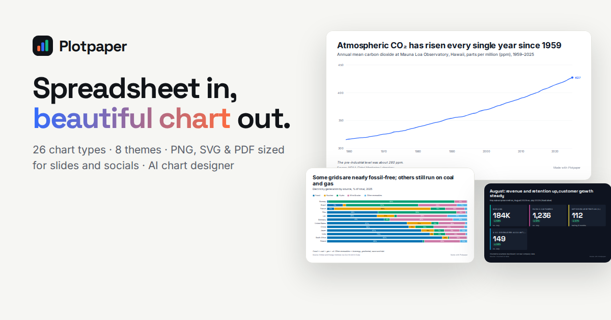

# Plotpaper

**Spreadsheet in, beautiful chart out.** Paste your data, pick one of 26 chart types, and export a crisp PNG sized for slides, reports or socials — with fonts embedded, sources credited and labels that never overlap. No account, nothing to install.



- **26 chart types** — columns, ranked bars, grouped & stacked, lollipop, dumbbell, waterfall, funnel, line, area, slope, calendar heatmap, pie, donut, treemap, waffle, scatter & bubble (log scales, trend lines), heatmap, histogram, box plot, radar, KPI cards, progress rings, timeline/Gantt.
- **Presentation-ready by default** — headline + subtitle + source + note, direct labels, legends, highlight-the-winner, smart label rotation/truncation, 8 themes, 12 palettes (incl. colorblind-safe), 6 font pairings, number formats for any country.
- **Export anywhere** — PNG 1×–4×, SVG, PDF, copy-to-clipboard, share links (the chart lives *inside* the URL), portable `.plotpaper.json` files. Sizes for slides, Instagram, stories, link previews, A4 or custom.
- **Data that just works** — CSV/TSV/JSON upload or paste from Excel/Sheets; understands `1.234,5`, `S/ 1.200`, `12%`, `(300)`, `N/A`; edit in a grid; wide or long data.
- **Creator Studio** — design new chart types with **PlotSpec**, a small declarative grammar (validated JSON, never code), or let **Claude** draft one from a sentence or a screenshot.
- **Local-first** — runs entirely in the browser. Supabase (accounts + community gallery) and Anthropic (AI) are optional.
- **42 real-world examples** in the gallery (NOAA, World Bank, Our World in Data, BCRP, EIA…), 6 in Spanish. UI in English and Spanish.

## Quick start

```bash
npm install
npm run dev              # http://localhost:3000 — everything works with zero config
```

Enable AI (optional):

```bash
echo "ANTHROPIC_API_KEY=sk-ant-..." >> .env.local   # or AI_PROVIDER=mock for a keyless demo
```

## Documentation

| | |
|---|---|
| [User guide](docs/user-guide.md) | Data, charts, styling, export, sharing, troubleshooting |
| [PlotSpec reference](docs/plotspec.md) | The grammar for custom chart types |
| [Creating chart types](docs/creating-chart-types.md) | Studio (no code) or TypeScript plugins |
| [AI features](docs/ai.md) | Claude integration, setup, privacy, demo mode |
| [Self-hosting & configuration](docs/self-hosting.md) | Env vars, branding, Supabase, deploying, security |

The same docs are served in the app at `/guide`.

## Architecture

```
src/
  app/                    Next.js App Router: landing, /build, /explore, /studio, /guide, /api/ai/*
  components/             UI (builder, gallery, studio, shell, auth)
  config/site.ts          Branding and defaults (all overridable by env vars)
  lib/
    viz/                  The chart engine — framework-agnostic, pure functions
      types.ts            ChartDefinition (the plugin contract), ChartDoc, styles
      engine.tsx          renderPoster(): title/legend/plot/footer → one SVG (preview = export)
      charts/*.tsx        The 26 built-in chart plugins + registry
      spec/               PlotSpec: types, validator, interpreter, templates
      data.ts             Parsing, type inference, auto-mapping, aggregation
      scale.ts format.ts text.ts themes.ts parts.tsx docOps.ts
      export/             SVG with embedded fonts, PNG/PDF/clipboard in the browser
    ai/                   Protocol, browser client, server (config, prompts, schemas, providers, handlers)
    examples/             42 example datasets (JSON) + loaders
    i18n/                 en / es dictionaries (type-checked parity)
supabase/migrations/      Optional schema with row-level security
tests/unit                Vitest: parsing, scales, every chart × hostile data, PlotSpec security, AI (fake Claude client)
tests/e2e                 Playwright: builder flows, exports, sharing, gallery, studio, mobile, large datasets
scripts/                  render-gallery (visual QA → PNG), og-image, seed, gen-examples
```

A chart is a document (`ChartDoc`: data + column mapping + options + style + text). `renderPoster(doc, definition)` returns one SVG element used for the on-screen preview, server-rendered gallery thumbnails and every export, so what you see is exactly what you get.

## Scripts

| Command | |
|---|---|
| `npm run dev` / `build` / `start` | Next.js |
| `npm test` | Unit tests (≈640) |
| `npm run test:e2e` | Playwright end-to-end tests (builds and starts the app with the mock AI) |
| `npm run test:db` | Apply the Supabase migrations to a throwaway Postgres and test row-level security (`DATABASE_URL=…`) |
| `npm run lint` / `typecheck` | ESLint / TypeScript |
| `npm run render:gallery -- [--examples] [--theme midnight] [--size 1080x1350] [--only bar,line]` | Render charts to `.render/*.png` for visual review |
| `npm run gen:examples` | Rebuild the examples manifest after adding a dataset |
| `npm run seed` | Publish the examples to a Supabase community gallery |

## Testing philosophy

Every built-in chart is rendered against empty data, single rows, zeros, negatives, 1e15 and 1e-9, garbage cells, 100-character unicode labels, 5,000 rows, every size preset, theme, palette, font pairing and option value — and the output is checked for `NaN`/`Infinity`. The AI pipeline is tested end-to-end with a fake Anthropic client that simulates refusals, truncation, non-JSON answers, rate limits, auth failures and schema rejections. E2E tests cover uploads (including a deliberately messy European CSV and 20,000 real flights), exports (PNG pixel sizes, embedded fonts), share links, the gallery, the Studio and mobile layouts.

## License

Private — all rights reserved (choose a license before publishing the source). Example datasets keep their original licenses; see [`src/lib/examples/datasets/SOURCES.md`](src/lib/examples/datasets/SOURCES.md). Bundled fonts are under the SIL Open Font License.
